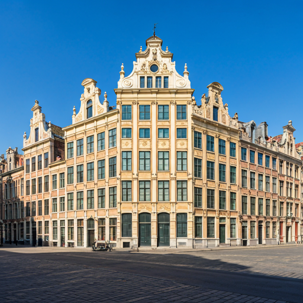

## Feu flamand : La chaleur des nuits boréales

À la découverte de l'esthétique des briques rouges et de la scène culturelle vibrante qui définissent l'identité transfrontalière unique de Lille.

### Le dialogue des textures

Lille ne se contente pas d’exposer sa brique ; elle la met en scène. Ce matériau humble, né de la terre des Flandres, capture la lumière rasante pour transformer chaque façade en un brasier immobile. Dans le Vieux-Lille, le contraste entre le rouge flamboyant du calcaire de Lezennes et le blanc des chambranles crée une rythmique visuelle presque musicale. C’est une architecture qui refuse la froideur, préférant la rugosité chaleureuse au lissé impersonnel de la modernité.

### L'effervescence des estaminets

Lorsque le ciel s'assombrit, la chaleur migre vers l'intérieur. Les fenêtres s'illuminent, révélant la vie qui palpite derrière les carreaux. La scène culturelle ne s'arrête pas aux musées ; elle s'invite aux tables de bois brut. Dans ces refuges de convivialité, l'identité transfrontalière s'exprime par le goût : l'amertume du houblon rencontre la rondeur du fromage de caractère, tandis que les rires effacent les frontières géographiques.

« Ici, le Nord n'est pas une direction, c'est un tempérament : une résistance joyeuse à la mélancolie des nuits d'hiver. »

### Une modernité héritée

Lille ne reste pas figée dans son passé textile. L'ancienne brique industrielle, autrefois symbole de labeur, est devenue le canevas d'une création contemporaine audacieuse. Des friches transformées en centres d'art aux quartiers futuristes, la ville prouve que son feu intérieur est loin de s'éteindre. Elle se réinvente sans jamais trahir sa couleur originelle, celle d'une terre qui sait rester ardente sous la grisaille.
