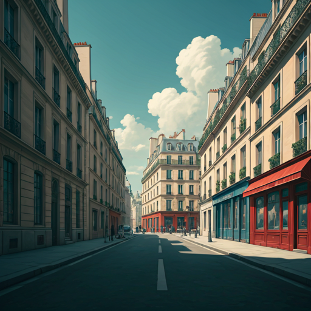

## L'architecture Haussmann: Le silence des boulevards

L'héritage architectural de l'urbanisme du XIXe siècle acquiert une dimension mystique lorsque la foule disparaît et qu'il ne reste que la pierre.

### La symétrie des ombres

Sous la lumière rasante, les façades s'alignent avec une rigueur militaire. Les balcons filants du deuxième et du cinquième étage tracent des lignes de fuite infinies, soulignant la perspective forcée des boulevards. Sans le mouvement des passants, l'œil s’arrête enfin sur la modénature : la finesse des consoles, le grain du calcaire lutécien et la répétition hypnotique des hautes fenêtres.

### Un théâtre sans acteurs

Le silence transforme la rue en une scène de théâtre vide. Les larges trottoirs, conçus pour la déambulation bourgeoise et la circulation fluide, révèlent leur véritable échelle. Ce n'est plus un lieu de passage, mais un volume monumental où le vide semble peser autant que le plein. Les toits en ardoise, avec leur inclinaison caractéristique à 45 degrés, découpent sur le ciel une silhouette bleutée qui semble veiller sur la solitude du pavé.

« Dans ce dépouillement, l'immeuble haussmannien cesse d'être une simple habitation pour redevenir une sculpture urbaine. »

### La respiration du calcaire

L'absence de bruit permet de percevoir la texture de la ville. On remarque alors comment la pierre boit la lumière ou rejette l'ombre selon l'heure. Ce "silence des boulevards" n'est pas une absence, mais une présence : celle d'une vision urbanistique qui a cherché à discipliner le chaos pour imposer l'ordre de la ligne droite.
